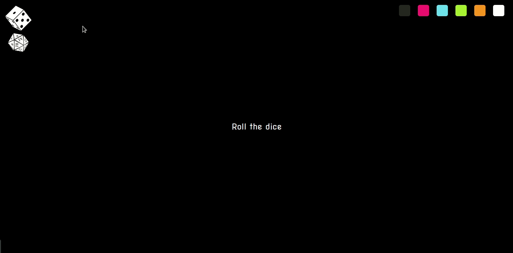

#  Dice

Dice is an application to roll dices with 3d appereance and animation



## Run the application

### Run with Docker

To run the application with Docker you just need to run the following commands:
```sh
docker build -t dice .
docker run -it --rm -v ${PWD}:/app -v /app/node_modules -p 3001:3000 -e CHOKIDAR_USEPOLLING=true dice
```

Made with React, this app creation improved my learnings on:
- React Components
- Redux
- Css animation
- Css 3d concepts
- Dinamic css rules generation
- CSS variables

Hosted at https://awesome-dice.herokuapp.com/
